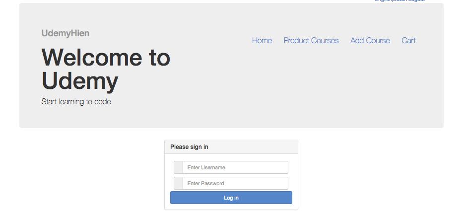
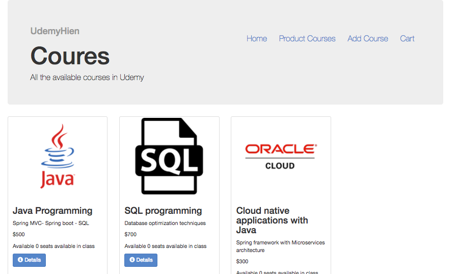
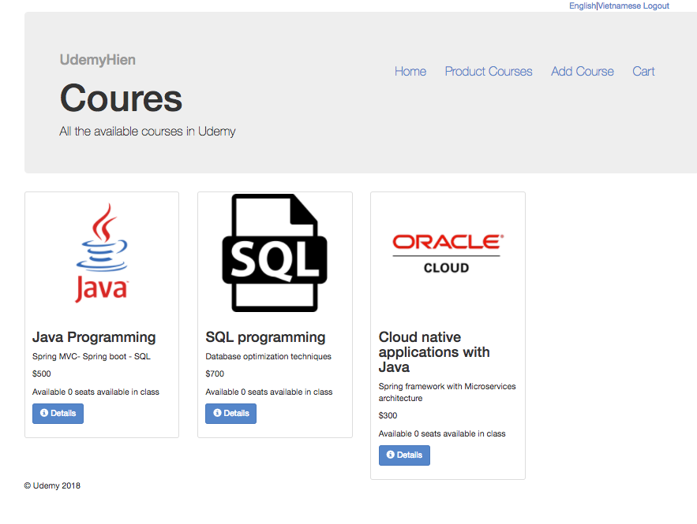
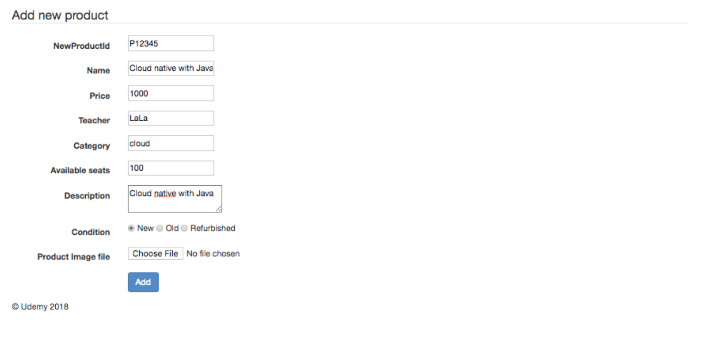
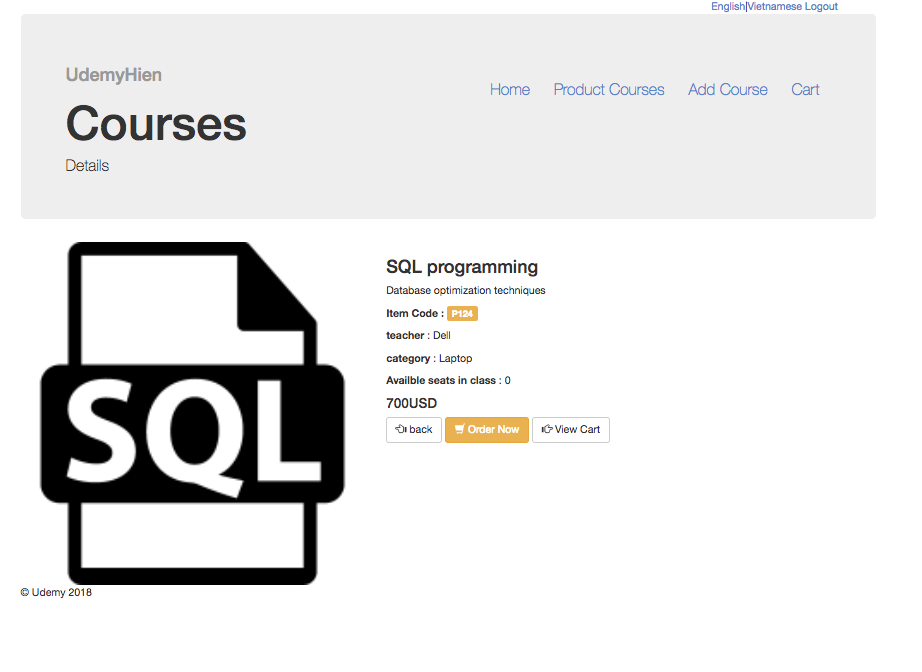
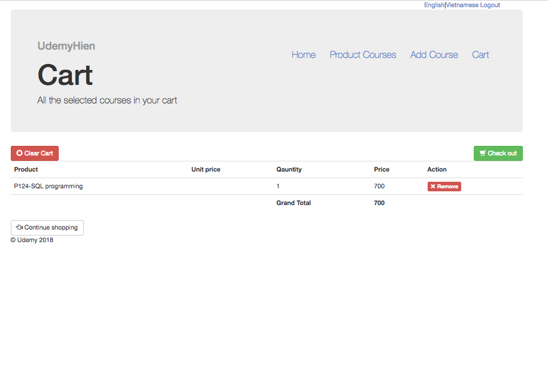

## Project overview
Udemy - clone project - The idea of project based on some features of Udemy
+ Teacher can add course , view course, edit course, delete course
+ User can view course , view detail of the courses and add courses to cart
+ User details are taken to process the payment 
+ Login system with Admin/Normal User

### Dependencies 
+ Spring Webflow 
+ Spring framework
+ HSQLDB
+ commons-fileupload 
+ jackson
+ log4j :Logs is saved under C:\webstore\webstore-performance.log
+ Spring security
+ hibernate validator
+ spring webflow
+ JUnit 
+ i18n `http://localhost:8080/webstore/products/add?language=en`

### Run the project 
+ `git clone`
+ Run with normal Spring MVC project with Tomcat 
	
### Screenshot

	
	
		
Spring boot: https://github.com/mintster/nixmash-spring
Chat :Spring MVX, servlet, async, Redis branch for distributed chat 
https://github.com/rstoyanchev/spring-mvc-chat

U: admin P: root123
U: hien  P: pa77word
